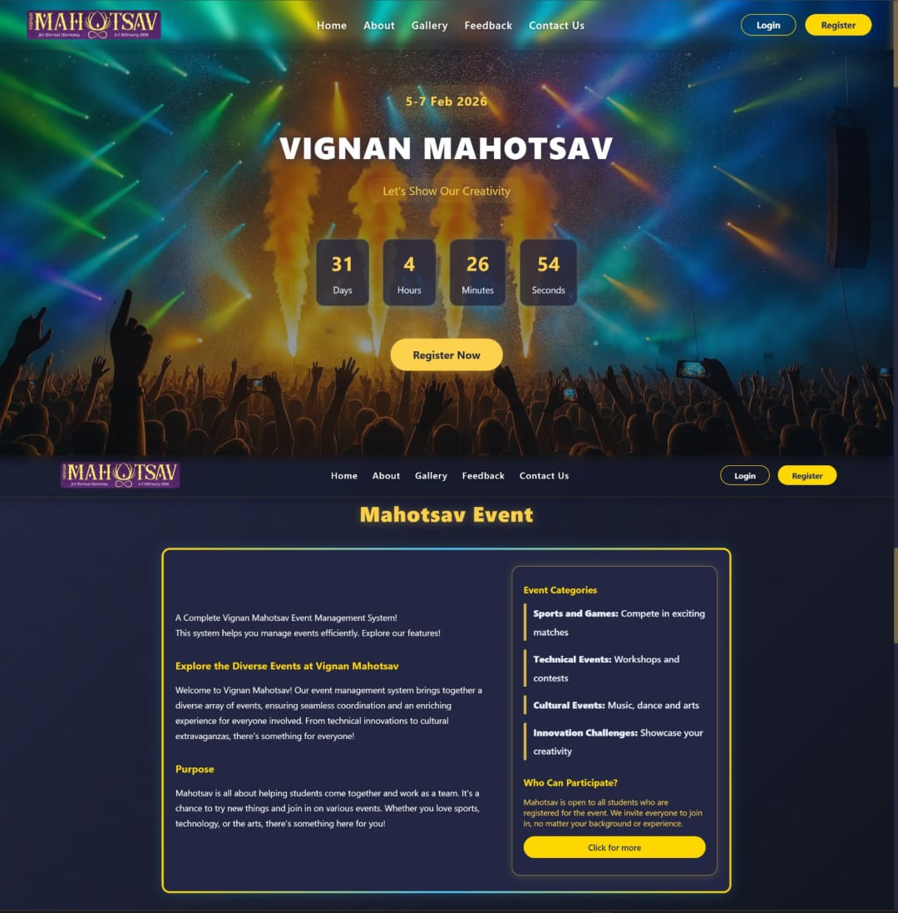
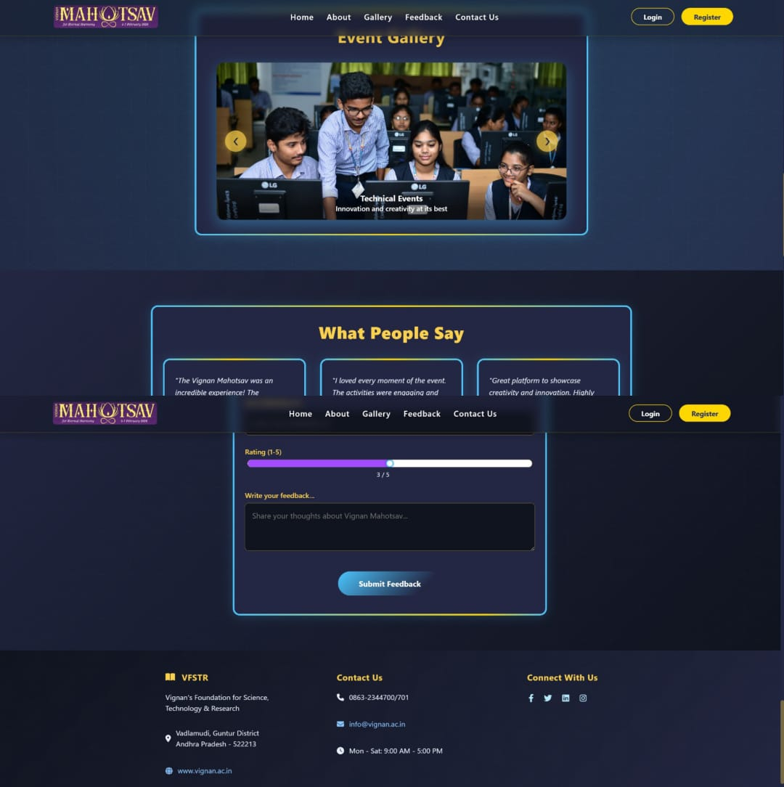
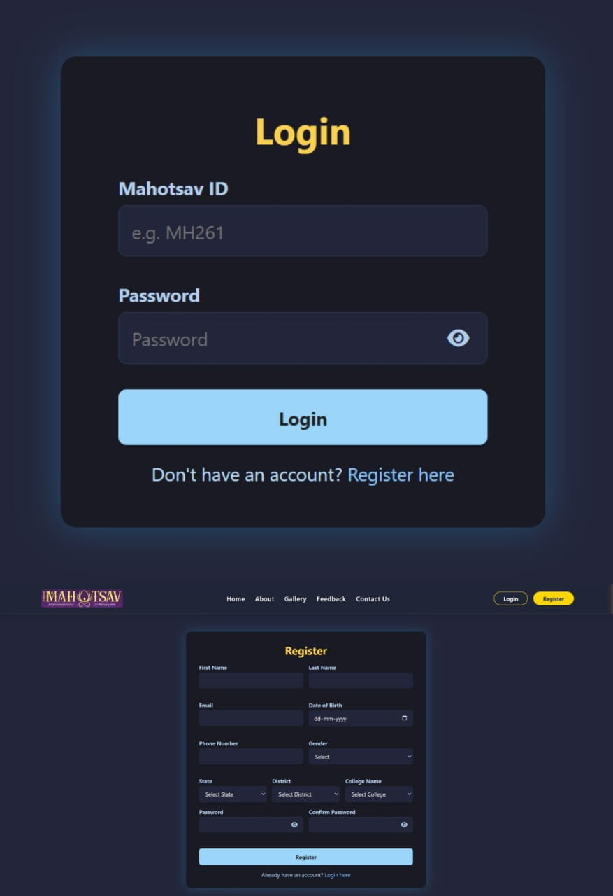
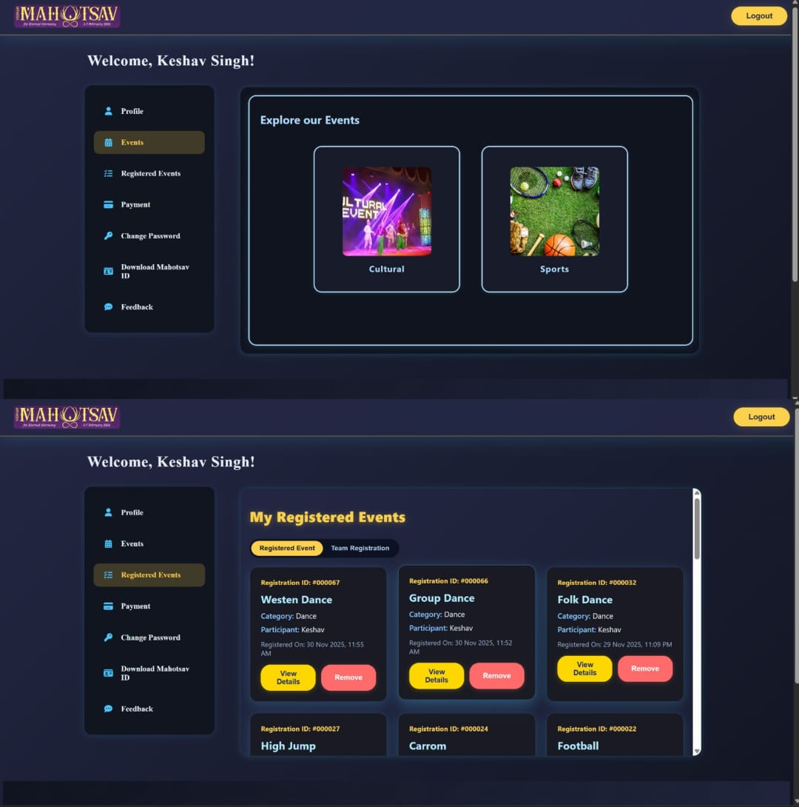
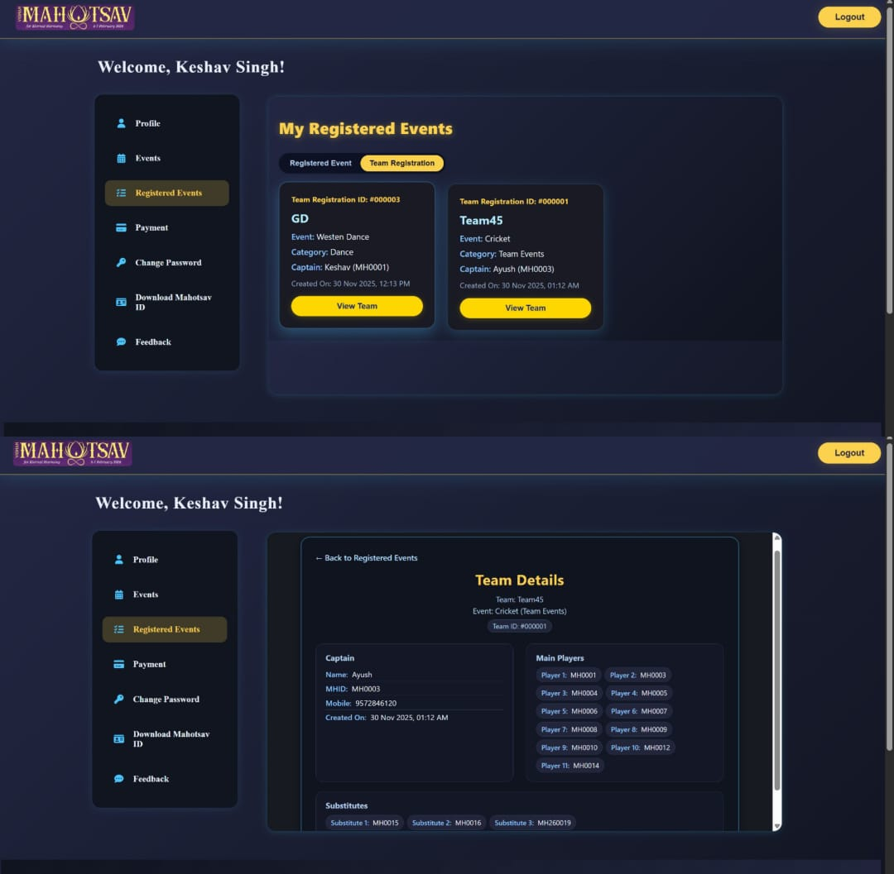
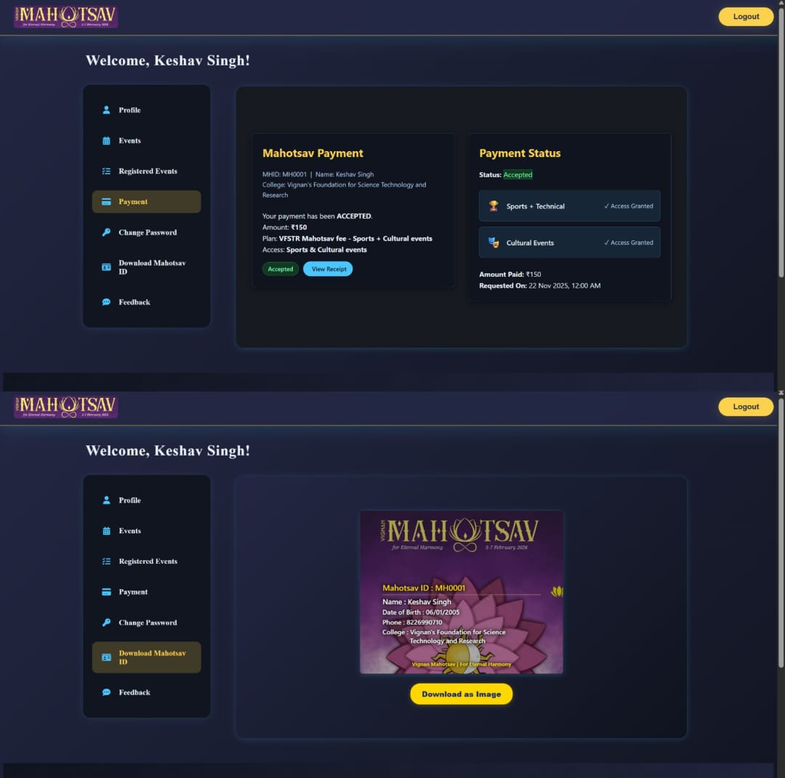

# 🚀 Vignan_Mahotsav — College Fest Management System

**Vignan Mahotsav** is a **full-stack web platform** designed to manage, organize, and showcase college fest events efficiently.  
It enables seamless handling of **event registrations, schedules, payments, and participant engagement** through a **secure, role-based system**.

---

**[🌐 Live Website]**(https://keshav-192.infinityfree.me)

## 🧠 About the Project

**Vignan Mahotsav** is a **professional full-stack college fest management website** built to streamline **event organization**, **participant registration**, and **administrative control**.

The platform is divided into **three dedicated portals**, each with clearly defined responsibilities to ensure **smooth, secure, and scalable fest operations**:

- 👤 **User Portal**
- 🎯 **Coordinator Portal**
- 🛡️ **Admin Portal**

---

## 👤 User Portal

The **User Portal** provides a smooth and user-friendly experience for participants. Users can:

- Register for multiple fest events  
- Make secure online payments  
- Submit feedback for events  
- View all registered events  
- Edit and manage profile details  

This portal focuses on **ease of use, accessibility, and engagement**.

---

## 🎯 Coordinator Portal

The **Coordinator Portal** enables efficient event execution and management. Coordinators can:

- Create and manage fest events  
- Accept both online and offline payments  
- Assign and manage sub-coordinators  
- Track event registrations and payments  
- Monitor event-related activities  

This portal ensures **proper coordination and smooth execution**.

---

## 🛡️ Admin Portal

The **Admin Portal** is restricted to a **single super admin** and provides complete system-level control. The admin can:

- Assign and manage coordinators  
- Block or remove coordinators when required  
- View all events and coordinator details  
- Monitor overall fest performance  
- Access analytics and system insights  

This portal ensures **security, transparency, and centralized administration**.

---

## ✅ Overall Objective

The objective of this project is to deliver a **scalable, secure, and professional web solution** for managing **large-scale college festivals**, while:

- Reducing manual effort  
- Improving efficiency and accuracy  
- Enhancing user engagement  

---

## 🛠️ Tech Stack

### Frontend
- HTML  
- CSS  
- JavaScript  

### Backend
- PHP  

### Database
- MySQL (XAMPP Server)

### Tools & Platforms
- Git & GitHub  
- VS Code  
- XAMPP  

---

## ✨ Key Features

- User Authentication & Authorization  
- Role-Based Access Control  
- CRUD Operations  
- Responsive User Interface  
- Secure API Integration  
- Error Handling & Input Validation  

---

## 🖼️ Screenshots

---

## ⚙️ Installation and Setup

Follow the steps below to set up and run the project locally.

---

### 🔧 Prerequisites

Ensure the following are installed on your system:

- PHP 8.x or above  
- Apache Server (XAMPP / WAMP / LAMP)  
- MySQL Database  
- Git  
- VS Code (Recommended)  

---

## 📥 Clone the Repository

git clone https://github.com/keshav-192/Vignan_Mahotsav---College_Fest.git
cd Vignan_Mahotsav---College_Fest

📁 Project Placement
If using XAMPP, place the project inside:

C:/xampp/htdocs/
Example:

C:/xampp/htdocs/Vignan_Mahotsav/
## 🗄️ Database Setup
Start Apache and MySQL from XAMPP Control Panel

Open phpMyAdmin

Create a database:

CREATE DATABASE vignan_mahotsav;
Import the provided SQL file:

database/practise.sql
## ▶️ Run the Project
Open your browser and visit:

http://localhost/Vignan_Mahotsav/
Login using appropriate credentials for User, Coordinator, or Admin.

## 📜 License

This project is licensed under the **MIT License**.

You are free to:

- **Use** the project for personal or educational purposes  
- **Modify** and **distribute** the source code  
- **Build upon** this project for learning and development  

⚠️ **Commercial usage requires proper attribution to the original author.**

---

## 👨‍💻 Author

**Keshav Singh**  
**Full Stack Developer** *(PHP & Java Full Stack – Advanced Java)*

- Strong interest in **backend development using PHP**  
- Passionate about building **scalable, role-based web applications**  
- Focused on writing **clean, secure, and maintainable code**  

---

## 📬 Contact

- 📧 **Email:** 231fa04g36@gmail.com  
- 🔗 **GitHub:** https://github.com/keshav-192  

Feel free to reach out for:

- **Project feedback**  
- **Collaboration opportunities**  
- **Technical discussions**  

---

## ⭐ Rating

If you found this project helpful, please consider giving it a ⭐ on **GitHub**.

